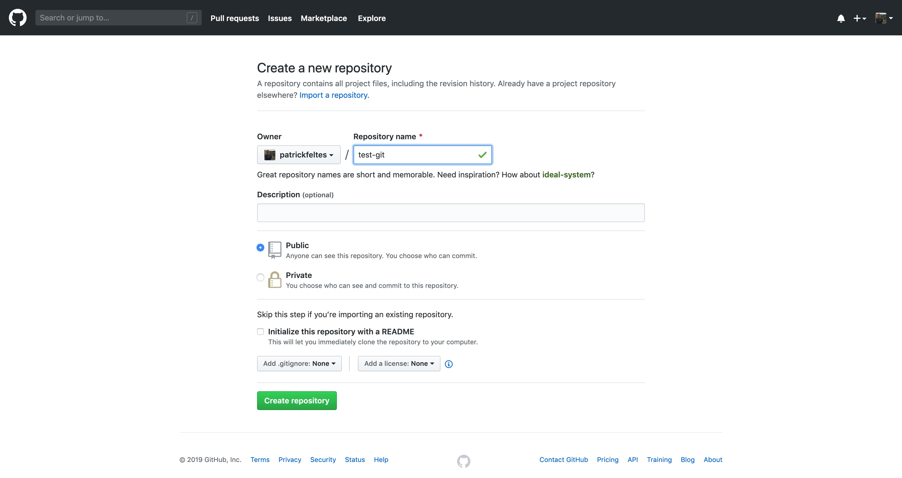
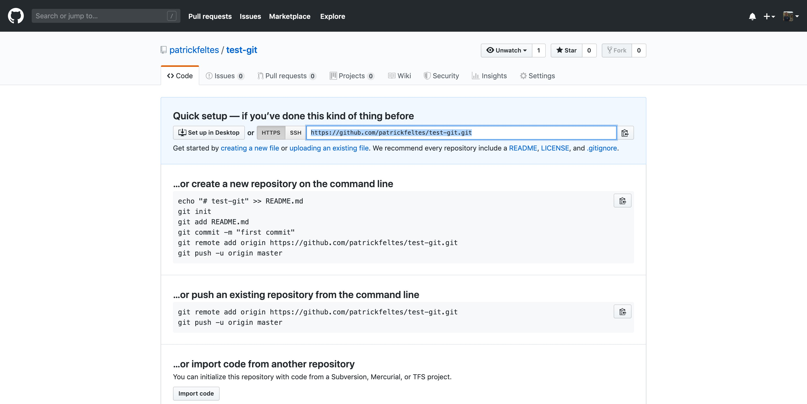
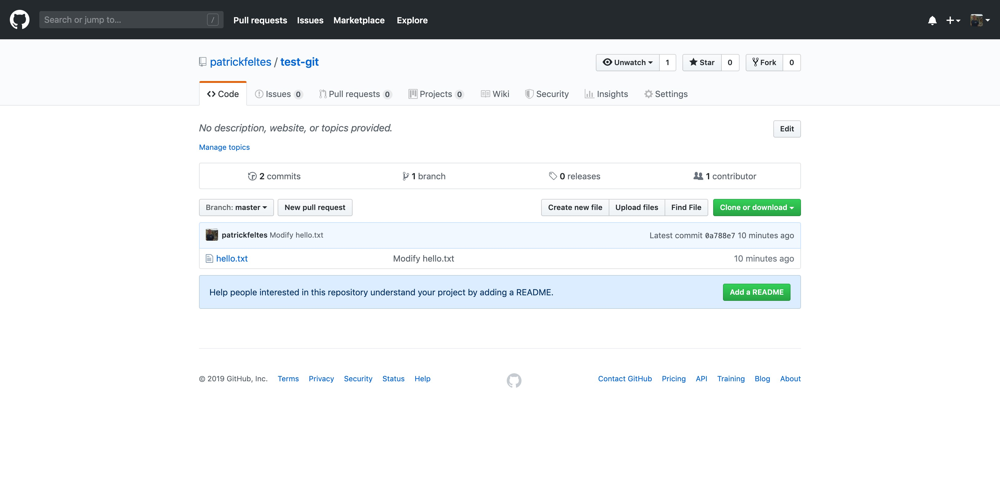
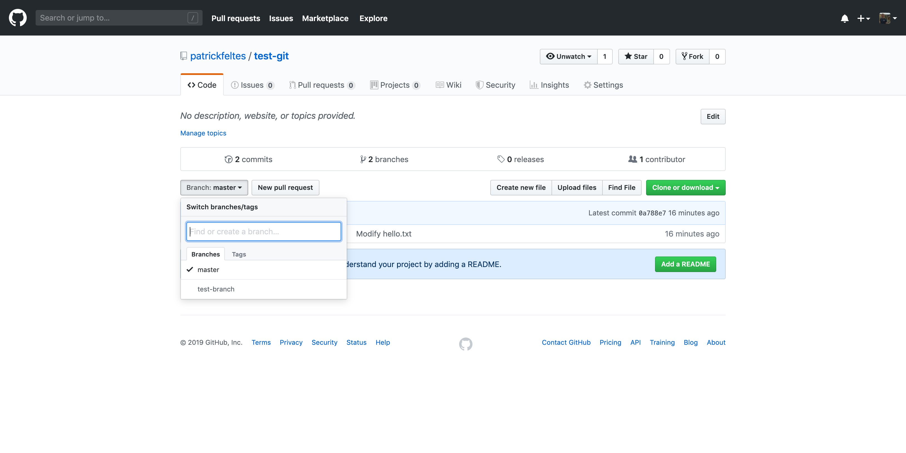
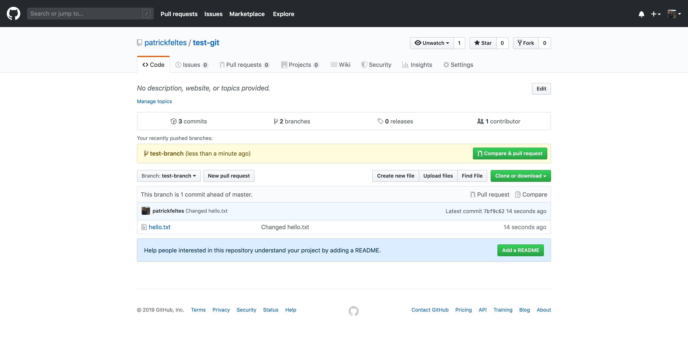
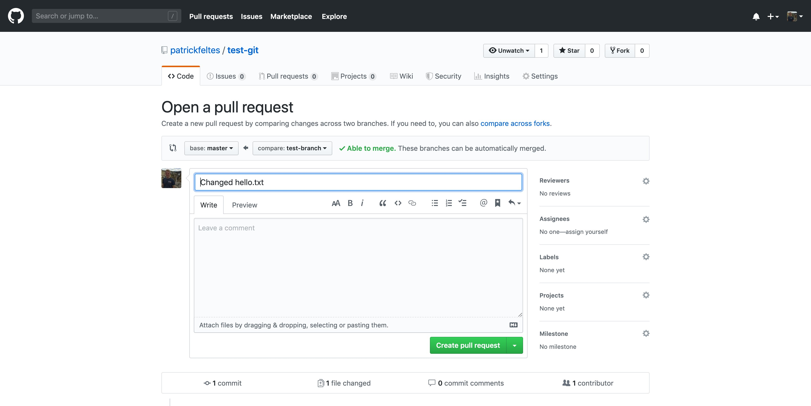
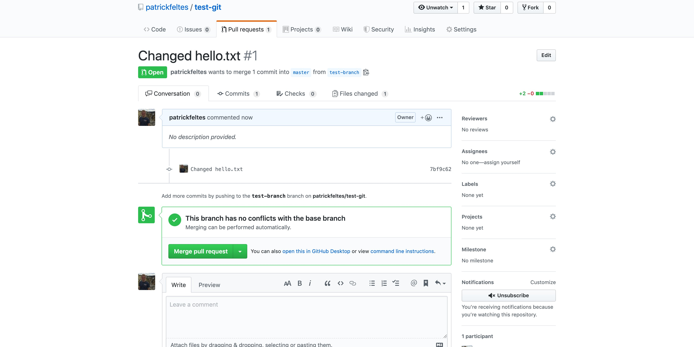
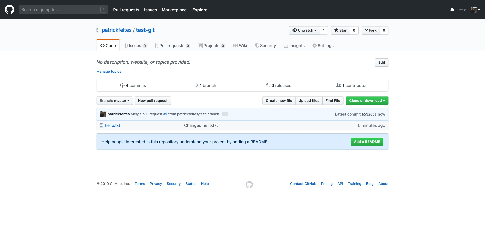

# Git Basics

## Installation
Go to https://git-scm.com/downloads to install Git on your computer.

## What is Git?
Git is a version control system, which means that it allows developers to check in versions of their code so that they have a history that they can look back on and move around in. It also has many nice features that allow collaboration on projects.

## What is GitHub?
GitHub is a website where you can store your Git repositories, so that many people can access and use them. It has a lot of features that make team project work much more streamlined.

## Basic Git Workflow
Open a terminal and type

```sh
cd ~
mkdir test-git
cd test-get
git init
```

What we've done is created a folder called test-git and then created a git respository inside it. What this means is that there is now a .git folder in this folder keeping track of all history in this folder. To see it, type
```sh
ls -a
```

Now, create a file called hello.txt and add some content to it. You can do this by typing:
```sh
touch hello.txt
vim hello.txt
```
and then entering something into the file. You can also just use a text editor if you don't know how to use vim.

After you've done this, type
```sh
git status
```

You should see hello.txt in red under "untracked files." This means that the git repository is not currently tracking changes to this file. To start tracking, type
```sh
git add hello.txt
git status
```
The git status command should show you that hello.txt is now being tracked. If you edit the file again and type `git status`, it will show up in red and green. The changes from before are staged for commit, but you need to do `git add hello.txt` again to incorporate the new changes.

Now that we've added all of our changes, we need to commit them to the repository. To do this, type:
```sh
git commit -m "Add hello.txt"
```
A commit is a snapshot of your project that gets recorded in the project history. So, every time you make a change that is one "logical unit," you should commit it with a message explaining your changes. Now, if we make more changes to hello.txt, then type
```sh
git add hello.txt
git commit -m "Modify hello.txt"
```
we'll have made another snapshot of our project at this instant. If you type `git log`, you'll see a history of all the commits made.

## Pushing to GitHub
Now that we've made a few commits on our local Git repository, we might want to share them with others! To do this, we first need to make a GitHub repository. So, go to github.com and click on the "New" button on the top lefthand side of the screen. Enter a name, like test-git



and then press "Create repository."

Once you get to the next page, copy the highlighted link in this picture:


Now, navigate to your terminal and type
```sh
git remote add origin <copied-link>
```

What we just did is add a remote called origin pointing to our GitHub repository. A remote is just the name for a repository that lives somewhere else. So, we now have a reference to this online version of our repository, and we can push the changes we have made locally to be on this "remote" version. To do this, type

```sh
git push origin master
```
What this means is that we are pushing our local changes to the remote named origin, on the branch called "master." Every git repository has a branch called master, and this is where the main code lives.

Now, if you refresh your git repo, you should see something like this.



Now your code is shared with everyone!

## Branching
A useful technique in Git is something called branching. A branch is basically a copy of the git repository at a certain point in time, that is separate from the place it was copied from. A common usecase is that we create a branch for a new feature or bugfix and make our commits there. Once we're confident that it's fixed, we can merge the changes made in the branch back into the master branch, which is the main branch of the git repo. This allows people to work on the project at the same time, without having to deal with each other's commits messing up our commits. Let's see how to do this:

In your terminal, type:
```sh
git branch
```
This shows you all the local branches of the repository. Right now, it should just say master.

Now, type
```sh
git branch test-branch
git branch
```

This created a new branch, and you can see it after the git branch command. There is a star next to master because it is the branch you are currently working on. Now, type
```sh
git checkout test-branch
git branch
```
This switches you to work on the test-branch, as you can see, the star has moved over. Now, make some changes to hello.txt. Then type
```sh
git add hello.txt
git commit -m "Made changes to hello.txt"
git push origin test-branch
```
We added our changes, made a commit with them, and then pushed them up to GitHub, but under the branch test-brach.

If we go to GitHub, we see the same thing as before, but open the dropdown that says master.



If you select test-branch, we can see that there are now three commits because the third commit was made on test-branch.



## Pull Requests
There are several ways to merge branches back into the main branch, but I'll cover Pull Requests here since they are good for group projects. In order to make a Pull Request, go to the GitHub repository and click "New Pull Request."

Select the base branch to be master and the compare branch to be test-branch. Then add a title and comments and click "Create Pull Request."



Once you're done with this, you can click "Merge Pull Request" and then "Delete Branch"



Now that we've merged the pull request, there are 4 commits. This is because of the one commit in test-branch, plus the commit made for the actual merge.


One issue we have now is that our local version of the repository is out of date. To fix this, go to the terminal and type:

```sh
git checkout master
git pull origin master
```

What this does is first switch us to the master branch on our local repository then it grabs the changes from the remote called "origin" and branch called "master" and merges them into out local master. Now, if you type

```sh
git log
```

you should see all the commits.

## Future
There is a lot more things you can do with git, so if you have any specific questions, feel free to come see me for help!